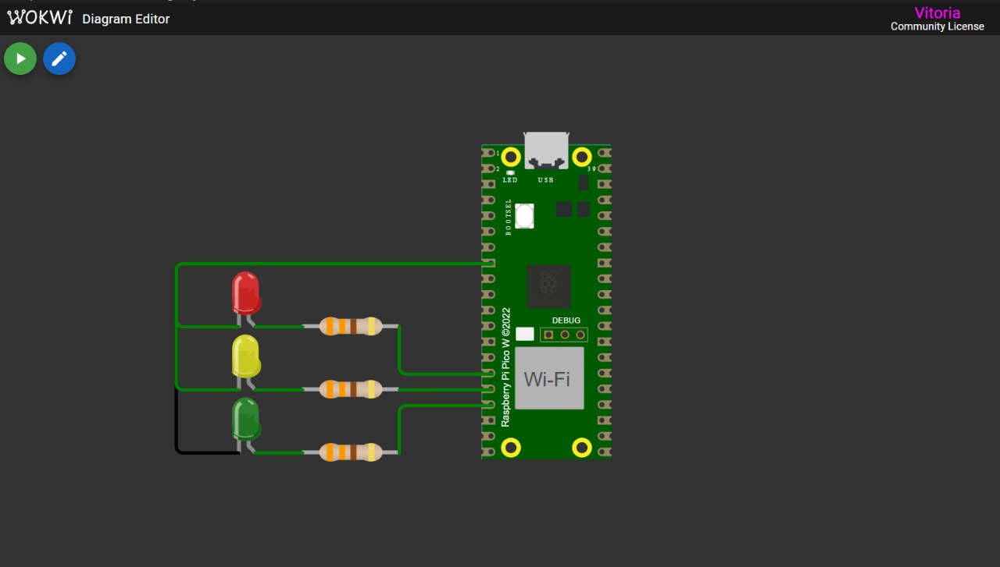

<h1 align="center"> Temporizador Periódico </h1>

## 📋 Sobre

 
Este projeto utiliza LEDs e o microcontrolador Raspberry Pi Pico para criar um semáforo. A lógica do semáforo alterna entre as luzes vermelha, amarela e verde, com um intervalo de 3 segundos entre cada cor. Para isso, utilizamos a função add_repeating_timer_ms() do Pico SDK.

## 🚀 Funcionalidades
O funcionamento do semáforo segue o seguinte fluxo:

| LED   | Ação                                                               |
|-----  |--------------------------------------------------------------------|
|  🔴  | Acende o LED vermelho, apaga os outros LEDs e aguarda 3 segundos   |
|  🟡  | Acende o LED amarelo, apaga os outros LEDs e aguarda 3 segundos    |
|  🟢  | Acende o LED verde, apaga os outros LEDs e aguarda 3 segundos      |
---

O cliclo do processo é contínuo.

    
     
    Figura 1. Simulador Wokwi

